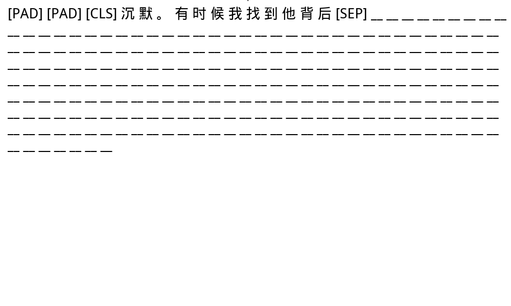
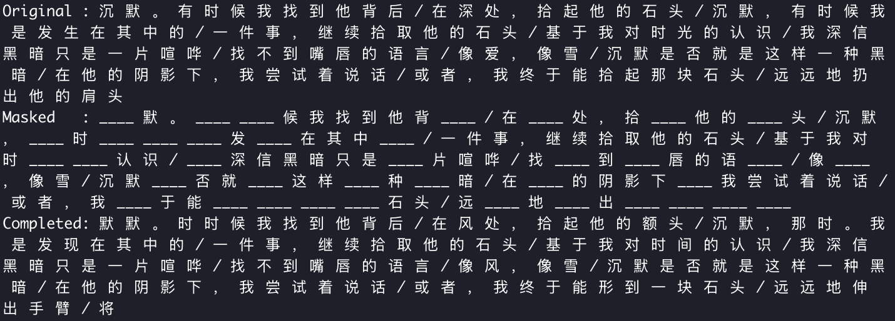

# DiffusionBert with Prefix 


<!-- Comments:这张GIF还存在一些问题：1. snapshot 不一致，第一张snapshot保存了全部token分布，但是后续snapshots截取掉了前3个token，表现在代码里`snapshots[:3]`,待后续修复，所有的snapshot采取统一的策略。 -->

## TL; DR

待施工...

## Intruduction

待施工...

## Undefined subtitle

<!-- 暂时不知道标题叫什么 -->

大语言模型(LLM)是一种生成式模型，通过学习大量的文本获取知识，生成与人类语言极为相似的文本。在训练过程中，LLM尝试去拟合真实语言的分布 $p_{data}(\cdot)$ ,让自己的模型分布 $p_{\theta}(\cdot)$  （其中 $\theta$ 是参数）最大限度地贴近实际语言数据的概率分布。

在训练过程中，LLM 用最大似然估计（maximum likelihood estimation, MLE）的方法调整参数，也就是不断优化模型，以使自己生成的数据在实际文本数据集出现的概率最高。数学表达就是：

$$
\max_{\theta} \mathbb{E}_{p_{data}(x)} \left[ \log p_{\theta}(x) \right] 
$$

上述最大似然估计本质上等价于最小化真实分布与模型分布之间的 KL 散度：

$$
\min_{\theta} \text{KL}(p_{data}(x) \parallel p_{\theta}(x))
$$

> KL散度是一种衡量两个概率分布之间差异的指标。越小表示模型生成的文本越贴近真实语言。

比如，若给一个语言模型看大量句子，每次预测下一个词，参数就会不断调整，最终让模型越来越擅长在各种语境下“猜”出下一个词，实现高度拟合自然语言。

$$ 
    p_\theta(x) = p_\theta(x^1) \prod_{i=2}^L p_\theta(x^i \mid x^1, \ldots, x^{i-1})
$$

其中x是长度为L的序列，$x^i$是第i个token。

这一方法已被证明极为有效，并成为当前大语言模型的基石。尽管其应用广泛，但一个根本性问题仍未得到解答：**自回归是否是实现大语言模型核心能力（如可扩展性、上下文学习及指令遵循）的唯一途径？**

答案并非简单的"是"。

生成建模原则（Generative Modeling Principle）,即前面的第一个公式，是训练LLM的根本目标：通过最大似然估计，让模型的概率分布无限接近真实数据的分布。

在LLM发展的早期和鼎盛阶段，几乎所有最成功的模型都同时采用了生成建模目标和自回归架构。由于它们总是成对出现，并且取得了巨大成功，很多人（包括领域内的许多研究者）很自然地产生了一种归因谬误：

> “LLM之所以拥有如此强大的能力（如推理、上下文学习等），是因为它们采用了自回归（next token prediction）的建模方式。”

这种观点认为，从左到右逐个生成这个特性本身，是孕育出LLM智能的关键土壤。

**但真正奠定LLM能力基石的，是“通过学习大量文本来逼近真实数据分布”这个更根本的【生成建模思想】。而自回归只是实现这个思想的一种（目前最主流的）技术路径，但它并非唯一路径，也可能不是最终路径。**

**LLM的许多核心能力源于“生成建模原则”，而其一些固有局限则直接源于“自回归架构”。**

统计学上有一个概念叫Fisher一致性，简单说就是“当你用最大似然估计（MLE）去优化模型时，如果模型足够强大、数据无限多，你最终一定能学到真实的数据分布”。

可扩展性主要是 Transformer、模型大小、数据大小和由生成原则引起的 Fisher一致性 之间相互作用的结果，而不是ARM的独特结果。

即模型越大、数据越多，性能越好，是因为MLE目标（生成原则）具有良好的理论性质，它保证了投入计算和数据的收益是可预测的。同时，Transformer架构能高效地利用这些计算和数据。

Diffusion在视觉上的成功支持了这一说法”。扩散模型在图像生成领域展现了惊人的可扩展性（模型越大、数据越多，图片质量越好），但它不是自回归模型。这提供了一个强有力的证据，证明可扩展性是生成建模原则的普遍特性，而非自回归模型所独有。

将模型视为压缩器很流行，这种的观点认为，ARM可以被解释为无损数据压缩器：一个概率模型越好，它分配给真实数据序列的概率就越高，根据香农信息论，这等价于用更短的码长来表示数据，即更好的压缩。

这种“压缩即智能”的关联并不专属于自回归模型。任何强大的、能够准确建模数据概率分布的模型（即“足够表达的概率模型”）都自然是一个好的压缩器，也因此会蕴含智能。

然而，LLM的某些固有局限性可以直接归因于其自回归性质。例如，左到右的生成过程限制了它们处理反向推理任务的能力，这突显了当前模型泛化能力的典型失败。但是，这个“身体”本身有先天缺陷（比如只能从左到右行动），这限制了“灵魂”在某些方面（如反向推理）的发挥。

打个比方，生成建模原则（第一个公式） 是LLM的 “灵魂” 。它赋予了模型可扩展性、指令遵循、上下文学习等核心智能。自回归架构（第三个公式） 是LLM目前的 “身体” 。它是一个非常高效、强大的“身体”，能够很好地承载这个“灵魂”。


如果我们能为“生成建模”这个强大的灵魂，找到一个比“自回归”更灵活、更少限制的新身体（例如，非自回归模型、扩散语言模型等），我们或许能创造出克服当前局限的下一代模型。

而无论是diffusion 还是其他预训练大模型，都有一个共同的目标——去噪声（denosing）[1], 这给我们结合这两种模型提供了可能。

### Short history of transformer

2017年，在论文[Attention Is All You Need](https://arxiv.org/abs/1706.03762)提出的原始Transformer架构采用encoder-decoder设计。2018年，随着BERT和GPT的诞生，研究者发现该模型的encoder与decoder可拆分为两大独立体系：

1. encoder-only（BERT式，双向架构）
这类模型采用掩码语言建模（MLM）作为训练目标：随机遮蔽输入文本中的部分token，训练encoder重构被遮蔽内容（完形填空）。模型能同时观测整个（部分遮蔽的）上下文，学习双向表征。该架构在需要全句（或段落）理解的任务中表现卓越（如文本分类与信息检索）。

2. decoder-only（GPT式，自回归架构）
这类模型采用下一token预测作为训练目标：在每个位置t处，根据截至t的所有上文内容预测t+1位置的token。仅使用左侧上下文进行预测（单向建模）。该架构在逐词生成的文本任务中优势显著，例如开放文本生成、摘要和翻译。

最初，BERT在分类等任务中迅速落地应用，而GPT式模型因早期能力有限未能立即普及。随着技术演进，自回归（decoder）Transformer的文本生成能力获得巨大提升。相较于encoder模型，“next token prediction”这一通用训练目标使其具备更广阔的应用场景空间。

扩散模型(Diffusion)最初在图像生成领域得到广泛应用。其基本原理是：对图像逐步添加高斯噪声（前向过程），然后训练神经网络进行迭代去噪（反向过程）。以下是图像连续扩散过程的概要说明：

前向过程：从清晰图像x₀出发，在每个时间步添加微量（通常为高斯）噪声，直至图像近乎完全变为噪声。

反向过程：训练模型（通常采用U-Net架构）预测各时间步的噪声分量，通过离散化去噪步骤逐步重建原始图像。

将这一理念应用于文本领域时，我们需要实现对文本的加噪与分阶段去噪。最简易的实现方式是采用基于掩码的噪声处理方案：

1. 前向（掩码）过程：

    在时间步 t=0 时，你拥有完全未损坏的文本序列。
    在后续每个时间步 t>0 中，根据预定义的调度计划（例如将掩码比例从0%逐渐增加至100%），随机将部分token替换为特殊的`[MASK]`标记。
    到最终时间步 T 时，整个序列可能被完全掩码（所有token均为`[MASK]`）。

2. 反向（去噪）过程：
训练模型（通常为标准Transformer encoder）根据时间步 t 的部分掩码序列预测原始token ID。
这类似于在不同掩码率下执行掩码语言建模：早期时间步仅少量token被掩码（易于预测）；后期时间步大量token被掩码（预测难度增加）。
通过将高掩码率至零掩码的预测结果串联起来，即可恢复（或生成）完整序列。

在此离散文本扩散框架中，模型通过优化所有时间步的去噪损失总和来学习数据分布的似然边界，而非在固定掩码概率下使用单一MLM目标。可以看出，BERT的掩码语言建模目标与文本扩散训练目标本质相同，但仅覆盖部分掩码率。通过引入可变掩码率（从0到1）和基于扩散理论设计的去噪步骤序列，我们能够将BERT的掩码语言建模目标转化为完整的生成流程。

<!-- TODO -->

## Method

本项目采用**扩散/去噪方法**，而非像GPT-2那样逐token从左至右生成文本。

1. 从固定文本前缀开始（前16个token）

2. 用掩码`[MASK]`填充剩余位置

3. 通过多步迭代预测并揭示标记

4. 逐步降低掩码概率直至完全去噪

这种方法利用BERT的双向上下文理解能力，通过迭代优化而非顺序预测来生成文本。

DBP是一个masked diffusion model, 使用带前缀，Diffusion 式的采样进行微调训练。使其在获得较不错文本生成的同时保留其指令遵守能力。在预训练过程中，以线性比例 $t\in U[0,1]$ 对部分token进行掩码处理。对前缀部分，特殊token不作掩码，来保留其指令遵循能力。在微调阶段(sft)，该模型模拟从完全掩蔽（t=1）到无掩蔽（t=0）的扩散过程，逐渐预测所有掩码。


<!-- 重绘这张图: 准确的来说，我们结合了pre-training and sft stage. that is training on mask ratio (0~1) while remaining the prompt unmasked. -->

上图来自论文[1],阐述了BertDiffusion的预训练和SFT以及采样的过程。

当前我们设置了10个扩散步骤，因此每批次会从掩码概率表mask_probs（1.0, 0.9, 0.9, …, 0.1）中随机选取一个百分比p，并按该比例对token进行掩码处理。自定义的diffusion_collator函数会为每批次从mask_probs中抽取一个掩码概率p，并以概率p将每个token替换为`[MASK]`标记。

为保留其promot fellow能力，我们始终保留前16个token不做掩码。这意味着在训练过程中，每个扩散步骤都将始终以前16个token作为上下文。

在推理过程中，我们从大小为256的张量输入开始（因为要生成256个标记块）。前16个位置对应prompt文本的token ID，后240个位置均为`[MASK]`标记。我们按照去噪调度表进行迭代，每一步生成预测结果后重新对序列进行掩码处理。具体流程如下：

```
Step 0: [PREFIX] <mask> <mask> <mask> <mask> <mask> ...     (100% masked)
Step 1: [PREFIX] will <mask> over <mask> control ...        (90% masked)
Step 2: [PREFIX] will begin <mask> greater control ...      (80% masked)
...
Step 10: [PREFIX] will begin to assert greater control ...  (0% masked - DONE)
```


## Dataset

我们编写了爬虫脚本，爬取了中国诗歌网来自308位著名的现代诗歌作者，共3640首现代诗。制作数据集chinese_mordern_poems，你可以在[Huggingface](https://huggingface.co/datasets/l0ulan/chinese_modern_poems)上找到这个数据集。我在附录提供了数据集的样本。

数据处理部分，采用人工和自动化脚本结合的方式。人工手动对数据集中的异常数据处理（比如数据带有超链接, 未定义的utf-8字符,其他无关文字等）。对诗歌的每一节，使用‘/’分割。


## Experiment

我们使用前面制作的数据集，搭建诗歌补全任务，评估模型性能。并和GPT-2（1.5B）对比性能。



上图为诗歌补全任务示例，对数据集chinese_modern_poems随机选取100首诗歌按一定比例进行挖空处理，并分别测试DBP和GPT-2在该任务上的表现。结果表明，在诗歌补全任务中，在所有的掩码比例中，DBP均超过GPT-2。

Poem Completion Task with 100 Chinese Modern Poems

| Mask Ratio| GPT-2| DPB |
| :--- | :--- | :--- |
| 0.10 | 19.79 | **54.37** |
| 0.20 | 16.06 | **49.97** |
| 0.30 | 12.81 | **41.44** |
| 0.40 | 9.27 | **35.31** |
| 0.50 | 7.07 | **26.25** |
| 0.60 | 5.11 | **20.21** |


## Conclusion

我们发现，像BERT这类最初为填空任务设计的掩码语言模型，可以通过将可变速率掩码解释为离散扩散过程，转化为完全生成式引擎。通过逐步用`[MASK]`标记破坏文本，并训练模型在不断增强的掩码强度下迭代去噪，我们有效将标准MLM目标转化为分步生成程序。

即使不作架构调整，仅需对训练目标稍作修改，微调后的BERT就能生成语义连贯的文本，这验证了BERT类模型本质上只是在单一掩码率上训练的文本扩散模型的观点。

待补充...

## Installation

This project uses [uv](https://github.com/astral-sh/uv) for package management.

```bash
# Install dependencies
uv sync
```

**Requirements:**
- Python >= 3.11
- PyTorch 2.7.0+
- Transformers 4.52.4
- Datasets 3.6.0
- Matplotlib 3.10.3
- Accelerate 1.7.0
- swanlab 

## Usage

### Basic Text Generation

Generate text using the RoBERTa diffusion model:

```bash
python inference.py
```

The script will:
- Prompt you for input text
- Generate continuation using iterative denoising
- Display step-by-step progress in terminal
- Create an animated visualization of the generation process

**Parameters** (edit in `inference.py`):
- `MAX_LEN`: Maximum sequence length (default: 256)
- `PREFIX_LEN`: Number of fixed prefix tokens (default: 16)
- `N_STEPS`: Number of denoising iterations (default: 10)
- `TOP_K`: Top-k sampling parameter (default: 50)
- `TOP_P`: Nucleus sampling parameter (default: 0.95)

### GPT-2 Baseline

For comparison, generate text using standard GPT-2:

```bash
python gpt2_inference.py
```

### Side-by-Side Comparison

Run both models simultaneously and compare outputs:

```bash
python compare.py
```

This creates a synchronized animation showing:
- RoBERTa diffusion generation steps
- GPT-2 autoregressive generation
- Timing metrics for both approaches

### Fine-tuning

Train your own RoBERTa diffusion model:

```bash
python finetune.py
```

**Training Details:**
- Dataset: l0lan/chinese_modern_poems
- Epochs: 800
- Batch size: 16
- Custom diffusion collator with variable masking
- Preserves first 16 tokens from masking
- Learning Rate: 3e-5 

## Project Structure

```
RoBERTaDiffusion/
    inference.py            # Main RoBERTa diffusion inference
    finetune.py             # Training script
    compare.py              # RoBERTa vs GPT-2 comparison
    gpt2_inference.py       # GPT-2 baseline
    benchmark_poem_completion.py # DiffusionBert vs GPT-2 on Poem Completion Task.  
    crawler.py # crawl the dataset for web. 
    hf_uploader.py #upload the dataset to huggingface 
    pyproject.toml          # Dependencies
    weights/                # Pre-trained models
```

## Acknowledgment

代码基于[nathan-barry/RoBERTaDiffusion](https://github.com/nathan-barry/RoBERTaDiffusion) — A research project exploring diffusion-based text generation using RoBERTa.

## References

1. [DiffusionBERT: Improving Generative Masked Language Models with Diffusion Models (He et al., 2022)](https://arxiv.org/abs/2211.15029)
2. [Large Language Diffusion Models (Nie et al., 2025)](https://arxiv.org/abs/2502.09992)
3. [BERT is just a Single Text Diffusion Step](https://nathan.rs/posts/roberta-diffusion/)
4. [Gemini Diffusion](https://deepmind.google/models/gemini-diffusion/)
5. [Attention Is All You Need(2017)](https://arxiv.org/abs/1706.03762)

## 附录

