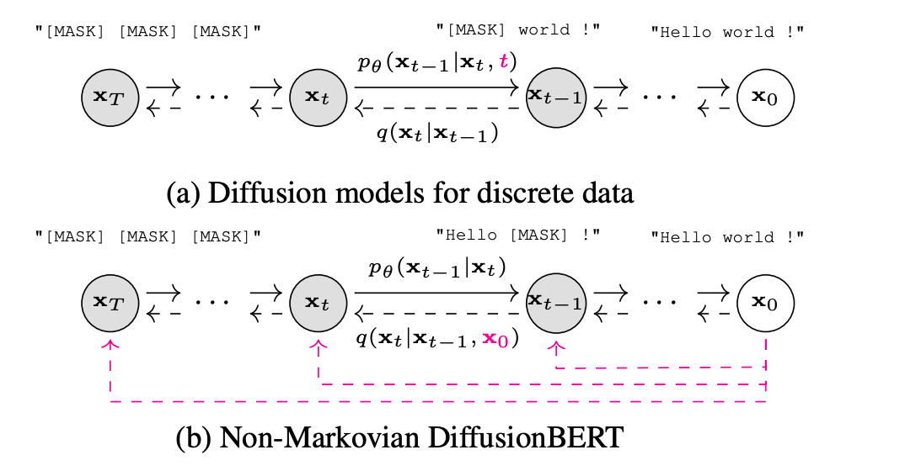
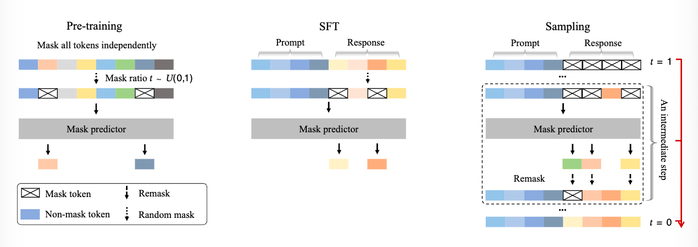
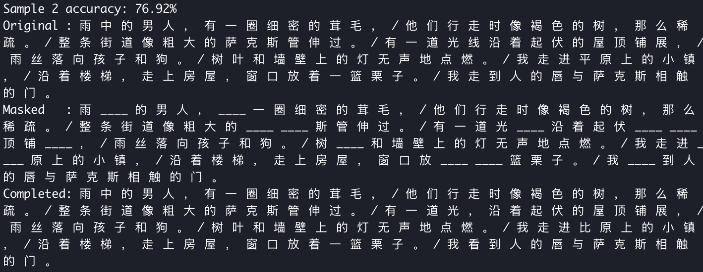

# DiffusionBert with Prefix 

大规模语言模型（LLM）的能力通常被认为依赖于自回归模型（ARM:autoregressive models）

## Instruction

大型语言模型（LLM）属于生成式模型的一类，其基本目标是通过学习大量真实文本，生成与人类语言极为相似的新文本。LLM 会尝试拟合真实语言的分布（记作 $$p_{data}(\cdot)$$），让自己的模型分布（$$p_{\theta}(\cdot)$$，其中 $$\theta$$ 是参数）最大限度地贴近实际语言数据的概率分布。

在训练过程中，LLM 用最大似然估计（maximum likelihood estimation, MLE）的方法调整参数，也就是不断优化模型，以使自己生成的数据在实际文本数据集出现的概率最高。数学表达就是：
$$
\max_{\theta} \mathbb{E}_{p_{data}(x)} \left[ \log p_{\theta}(x) \right]
$$

上述最大似然估计本质上等价于最小化真实分布与模型分布之间的 KL 散度：
$$
\min_{\theta} \text{KL}(p_{data}(x) \parallel p_{\theta}(x))
$$

> KL散度是一种衡量两个概率分布之间差异的指标。越小表示模型生成的文本越贴近真实语言。

比如，若给一个语言模型看大量句子，每次预测下一个词，参数就会不断调整，最终让模型越来越擅长在各种语境下“猜”出下一个词，实现高度拟合自然语言。

主流方法主要依赖于自回归建模（ARM）——通常被称为“下一词预测”范式。

$$

p_\theta(x) = p_\theta(x^1) \prod_{i=2}^L p_\theta(x^i \mid x^1, \ldots, x^{i-1})
$$

其中x是长度为L的序列，$x^i$是第i个token。

这一范式已被证明极为有效[2–5]，并成为当前大语言模型的基石。尽管其应用广泛，但一个根本性问题仍未得到解答：自回归范式是否是实现大语言模型核心能力（如可扩展性、上下文学习及指令遵循）的唯一途径？

我们认为答案并非简单的"是"。以前被忽视的关键见解是：是生成建模原则（即上述第一个方程），而非自回归公式本身，从根本上支撑了LLM的基本性质

特别地，我们认为可扩展性主要是Transformer、模型大小、数据大小和由第一个方程中的生成原则引起的Fisher一致性之间相互作用的结果，而不是第二个方程中ARM的独特结果。Diffusion在视觉上的成功支持了这一说法。此外，指令遵循和上下文学习能力似乎是所有条件生成模型在结构一致的语言任务上的固有性质，而不是ARM的独占优势。此外，虽然ARM可以被解释为无损数据压缩器[12,13]，但任何足够表达的概率模型都可以实现类似的能力[14]。

然而，LLM的某些固有局限性可以直接归因于其自回归性质。例如，左到右的生成过程限制了它们处理反向推理任务的能力，这突显了当前模型泛化能力的典型失败。



与传统离散扩散模型不同，DiffusionBERT采用BERT作为主干网络进行文本生成。主要差异已通过颜色标注：(1) DiffusionBERT在解码时无需知晓当前时间步，而标准扩散模型需以时间步为条件；(2) DiffusionBERT的扩散过程具有非马尔可夫特性，其噪声样本xt的生成不仅依赖于xt−1，还与x0相关。这种非马尔可夫过程源于我们提出的噪声调度方案。

不久前，谷歌DeepMind发布了实验性语言模型Gemini Diffusion，该模型采用扩散技术生成文本。与逐词生成的传统GPT式模型不同，Gemini Diffusion通过逐步优化随机噪声来生成完整文本段落。


## Method

受到[Large Language Diffusion Models (Nie et al., 2025)](https://arxiv.org/abs/2502.09992) 的启发,我们推出了DCPMP(Diffusion Chinese Poetry Model with Prefix).

DBP是一个masked diffusion model, 使用带前缀，Diffusion 式的采样进行微调训练。使其在获得较不错文本生成的同时保留其指令遵守能力。在预训练过程中，以线性比例 $t\in U[0,1]$ 对部分token进行掩码处理。对前缀部分，特殊token不作掩码，来保留其指令遵循能力。在微调阶段(sft)，该模型模拟从完全掩蔽（t=1）到无掩蔽（t=0）的扩散过程，通过灵活的重掩码机制，在每一步逐渐预测所有掩码。



## Dataset

我们制作了chinese_modern_poems 数据集，来自308位著名的现代诗歌作者，共3640首现代诗。(dataset in hf:l0ulan/chinese_modern_poems)样本可参考附录

## Experiment

我们使用前面制作的数据集，搭建诗歌补全任务，评估模型性能。

Poem Completion Task with 100 Chinese Modern Poems

Model: Diffusion  
Device: cuda  
Mask ratio: 0.10.   
Total masked tokens: 1659.   
Token accuracy: 54.37%.   

Model: GPT-2
Device: cuda
Mask ratio: 0.10
Total masked tokens: 1657
Token accuracy: 19.79%

---
Model: Diffusion
Device: cuda
Mask ratio: 0.20
Total masked tokens: 3312
Token accuracy: 49.97%

Model: GPT-2
Device: cuda
Mask ratio: 0.20
Total masked tokens: 3312
Token accuracy: 16.06%

---
Model: Diffusion
Device: cuda
Mask ratio: 0.30
Total masked tokens: 4974
Token accuracy: 41.44%

Model: GPT-2
Device: cuda
Mask ratio: 0.30
Total masked tokens: 4973
Token accuracy: 12.81%

--- 

Model: Diffusion
Device: cuda
Mask ratio: 0.40
Total masked tokens: 6635
Token accuracy: 35.31%

Model: GPT-2
Device: cuda
Mask ratio: 0.40
Total masked tokens: 6634
Token accuracy: 9.27%

---




## Overview

Instead of generating text left-to-right one token at a time (like GPT-2), this project uses a **diffusion/denoising approach**:

1. Start with a fixed text prefix (first 16 tokens)
2. Fill remaining positions with mask tokens
3. Iteratively predict and reveal tokens over multiple steps
4. Progressively decrease masking probability until fully denoised

This approach leverages RoBERTa's bidirectional context understanding to generate text through iterative refinement rather than sequential prediction.

## Key Features

- **Bidirectional Generation**: Unlike autoregressive models, can attend to full sequence context
- **Iterative Denoising**: Gradually reveals text over configurable number of steps
- **Prefix Control**: First 16 tokens remain fixed, providing stable context
- **Visual Animations**: Step-by-step matplotlib animations showing generation process
- **Comparative Analysis**: Side-by-side comparison with GPT-2 baseline

## Installation

This project uses [uv](https://github.com/astral-sh/uv) for package management.

```bash
# Install dependencies
uv sync
```

**Requirements:**
- Python >= 3.11
- PyTorch 2.7.0+
- Transformers 4.52.4
- Datasets 3.6.0
- Matplotlib 3.10.3
- Accelerate 1.7.0
- swanlab 

## Usage

### Basic Text Generation

Generate text using the RoBERTa diffusion model:

```bash
python inference.py
```

The script will:
- Prompt you for input text
- Generate continuation using iterative denoising
- Display step-by-step progress in terminal
- Create an animated visualization of the generation process

**Parameters** (edit in `inference.py`):
- `MAX_LEN`: Maximum sequence length (default: 256)
- `PREFIX_LEN`: Number of fixed prefix tokens (default: 16)
- `N_STEPS`: Number of denoising iterations (default: 10)
- `TOP_K`: Top-k sampling parameter (default: 50)
- `TOP_P`: Nucleus sampling parameter (default: 0.95)

### GPT-2 Baseline

For comparison, generate text using standard GPT-2:

```bash
python gpt2_inference.py
```

### Side-by-Side Comparison

Run both models simultaneously and compare outputs:

```bash
python compare.py
```

This creates a synchronized animation showing:
- RoBERTa diffusion generation steps
- GPT-2 autoregressive generation
- Timing metrics for both approaches

### Fine-tuning

Train your own RoBERTa diffusion model:

```bash
python finetune.py
```

**Training Details:**
- Dataset: Chinses Poems (configurable)
- Epochs: 30 (default)
- Batch size: 16
- Custom diffusion collator with variable masking
- Preserves first 16 tokens from masking

## Project Structure

```
RoBERTaDiffusion/
    inference.py            # Main RoBERTa diffusion inference
    finetune.py             # Training script
    compare.py              # RoBERTa vs GPT-2 comparison
    gpt2_inference.py       # GPT-2 baseline
    benchmark_poem_completion.py # DiffusionBert vs GPT-2 on Poem Completion Task.  
    crawler.py # crawl the dataset for web. 
    hf_uploader.py #upload the dataset to huggingface 
    pyproject.toml          # Dependencies
    weights/                # Pre-trained models
```

### Quick start 

```python
python benchmark_poem_completion.py --mask-ratio 0.5 --num-samples 100 --report-samples 1 --model-type both
```


## step 

1. load the dataset 
2. filter out the empty lines 
3. tokenized the content
4. concat all tokenized poems into a long token sequence 
5. group it into MAX_LEN chunck.
6. 

## Acknowledgment

代码基于[nathan-barry/RoBERTaDiffusion](https://github.com/nathan-barry/RoBERTaDiffusion) — A research project exploring diffusion-based text generation using RoBERTa.

## References
1. [DiffusionBERT: Improving Generative Masked Language Models with Diffusion Models (He et al., 2022)](https://arxiv.org/abs/2211.15029)
2. [Large Language Diffusion Models (Nie et al., 2025)](https://arxiv.org/abs/2502.09992)


## 附录

